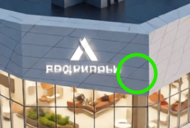
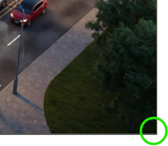

# 📍 Where's Waldo

[Live Preview:](https://where-s-waldo-zuzs-sable.vercel.app/)

A photo tagging game inspired by **Where's Waldo** where players race against the clock to find hidden characters within a large image.

## ✨ Features

- Click anywhere on the image to search for characters
- Server-side coordinate validation
- Prevent finding the same character twice
- Track and display your completion time
- Responsive design for desktop and mobile devices

## 🛠️ Built With

### Frontend

- React
- TypeScript
- Vite
- Tailwind CSS

### Backend

- Node.js
- Express
- Prisma ORM
- PostgreSQL

## 📸 Screenshots

### The Carnival Sprawl - Character Spot Hint

## 📚 What I Learned

This project helped me practice:

- Building a full-stack React application
- Designing REST APIs with Express
- Using Prisma ORM with PostgreSQL
- Server-side validation
- Managing game sessions
- Database transactions
- Coordinate-based game logic
- Backend testing
- Full-stack deployment

## 🙏 Acknowledgements

This project was completed as part of **The Odin Project** Full Stack JavaScript curriculum.
